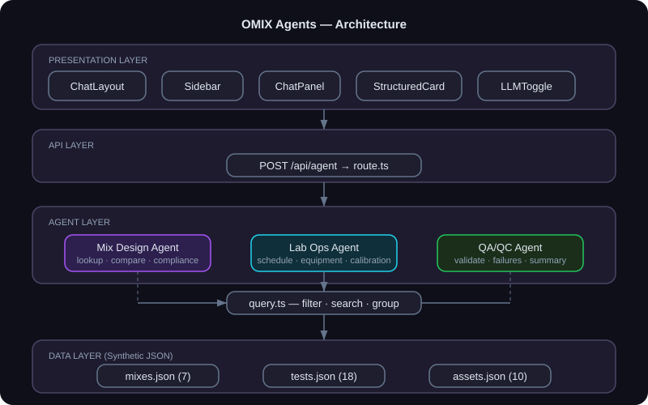

# Architecture

OMIX Agents follows a clean 4-layer architecture with no external dependencies beyond Next.js.

## Layer Diagram



## Layers

### 1. Presentation Layer
React components built with Next.js App Router and Tailwind CSS. The `ChatLayout` component owns top-level state (selected agent, messages, loading status) and orchestrates the `Sidebar` (agent selection + example prompts) and `ChatPanel` (message list + input).

Structured agent responses are rendered by `StructuredCard`, which inspects the `type` field of the response data and delegates to the appropriate view: tables, key-value pairs, timelines, compliance checks, or side-by-side comparisons.

### 2. API Layer
A single `POST /api/agent` route receives `{ agent, query, llmMode }` and dispatches to the appropriate agent handler. If `llmMode` is enabled, it returns a placeholder response explaining where LLM integration would occur. No authentication is required for this demo.

### 3. Agent Layer
Three pure-function agents, each following the same contract:

```typescript
(query: string) => AgentResponse
```

Each agent:
1. Detects intent via keyword matching
2. Extracts entity references (mix IDs, project names) from the query
3. Queries the data layer using shared utilities
4. Returns `{ humanResponse, structuredData, nextQuestions }`

Agents share a `query.ts` utility module providing generic filtering, searching, grouping, and date-range operations over JSON arrays.

**Mix Design Agent** — Lookup, list, compare, compliance check, and recommend mix designs. Implements Superpave volumetric compliance rules (VMA by NMAS, VFA range, air voids, dust-to-binder ratio, RAP warnings).

**Lab Operations Agent** — Generate multi-day test plans, check equipment status, identify calibration issues, and report lab utilization. Cross-references equipment availability when building schedules.

**QA/QC Agent** — Validate test results against specifications, filter failures, generate quality summaries with pass rates, and show test history trends.

### 4. Data Layer
Three synthetic JSON files with realistic but fabricated pavement engineering data:
- `mixes.json` — 7 Superpave HMA mix designs with full volumetric properties and gradation curves
- `tests.json` — 18 lab test records (Hamburg, IDEAL-CT, TSR, Gmm, DSR) linked to mixes
- `assets.json` — 10 lab equipment items with calibration schedules and utilization metrics

## Key Design Decisions

- **No LLM dependency** — All logic is deterministic keyword matching. This makes the demo fully offline, reproducible, and free to run. The architecture is designed so that an LLM can be plugged in at the API layer for natural language understanding.
- **Pure functions** — Agents have no side effects and return typed responses, making them easy to test and compose.
- **Single API endpoint** — Keeps the routing simple; the `agent` field in the request body determines dispatch.
- **Synthetic data** — Realistic enough to demonstrate workflows without exposing proprietary information.
